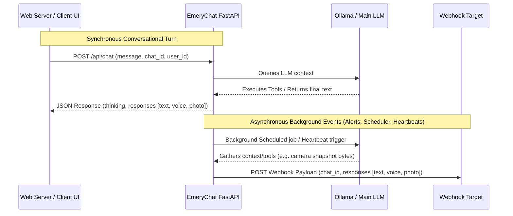

# 🛡️ EmeryChat (FastAPI HTTP API Mode)

[](https://www.python.org/)
[](https://fastapi.tiangolo.com/)
[](https://www.docker.com/)
[]()

EmeryChat is a headless, local-first agentic AI companion designed for home servers and personal dashboards. It exposes a clean HTTP API over FastAPI for web server integration, stripping out messaging client dependencies (like Telegram) and operating as a stateless service that tracks user histories, coordinates smart home devices, and dispatches background tasks. 

Background operations—like scheduled briefings, sleep heartbeats, and motion security alerts—automatically push outputs directly to a configured parent web server using HTTP webhooks.

---

## 📖 Table of Contents
1. [How It Works](#-how-it-works)
2. [API Reference](#-api-reference)
3. [Webhook Event Notifications](#-webhook-event-notifications)
4. [Model Performance Matrix](#-model-performance-matrix)
5. [Quickstart Setup Guide](#%EF%B8%8F-quickstart-setup-guide)
   - [Step 1: Local & Cloud Model Setup (Ollama / Open WebUI)](#step-1-local--cloud-model-setup-ollama--open-webui)
   - [Step 2: Environment Configuration](#step-2-environment-configuration)
   - [Step 3: Google Service Authentication (Calendar & Nest)](#step-3-google-service-authentication-calendar--nest)
   - [Step 4: Run the Application](#step-4-run-the-application)
6. [🧠 Staged Persistent Memory System](#-staged-persistent-memory-system)
7. [🛠️ Tool Library & Configuration](#%EF%B8%8F-tool-library--configuration)
8. [📅 Task Scheduling & Automated Briefings](#-task-scheduling--automated-briefings)
9. [⚙️ Environment Variables Reference](#%EF%B8%8F-environment-variables-reference)

---

## ⚡ How It Works



* **FastAPI Server:** Listens on port `8000` (configurable) for incoming queries, context wipes, and history clearing commands.
* **Context-Scoped Outgoing Assets:** When the LLM calls asset-generating tools (like creating speech voice clips via Kokoro TTS, painting images via Gemini, or pulling security camera feeds), the base64-encoded files are captured in-memory and cleanly attached to the JSON response block.
* **Proactive Webhooks:** When background loops fire (like an NVR person-detection alert, a scheduled reminder, or a sleep/heartbeat check-in), the generated asset outputs are wrapped in a standard JSON payload and pushed to your parent web server's webhook endpoint.
* **Concurrency Protection:** Uses `asyncio.Semaphore` locks to serialize HTTP requests to your main Ollama model (`main_model_lock`) and secondary coprocessor (`fast_model_lock`), avoiding VRAM spikes and protecting local services from overloading.

---

## 📡 API Reference

EmeryChat endpoints can be protected by setting an `API_KEY` in `.env`. If set, you must pass the key in the headers as `Authorization: Bearer <YOUR_API_KEY>`.

### 1. Send Message (`POST /api/chat`)
Submits a query to the agent. Supports incoming text, voice recordings (for auto-transcription), and photos (for visual description).

* **Request Headers:**
  * `Content-Type: application/json`
  * `Authorization: Bearer YOUR_API_KEY` (Optional)
* **Request JSON Schema:**
  ```json
  {
    "message": "Please take a picture of the front door camera and describe what you see",
    "chat_id": "unique-conversation-id-abc",
    "user_id": "12345",
    "sender_name": "Hudson",
    "photo": null,         // Optional: Base64-encoded image string
    "photo_caption": null, // Optional: User caption for the uploaded photo
    "voice": null          // Optional: Base64-encoded audio clip to transcribe
  }
  ```
* **Response JSON Schema:**
  ```json
  {
    "thinking": "Emery's internal thought process text...",
    "responses": [
      {
        "type": "photo",
        "data": "iVBORw0KGgoAAAANS...", // Base64 JPEG snapshot bytes from camera
        "caption": "📸 Live: FRONTDOOR\n\nSecurity report: No active activity detected."
      },
      {
        "type": "text",
        "content": "<p>I grabbed a snapshot from the frontdoor camera. Security logs report that the porch is clear.</p>"
      }
    ]
  }
  ```

### 2. Clear Chat History (`POST /api/clear`)
Flushes the short-term conversation context deque for the specified chat ID.
* **Request JSON Schema:**
  ```json
  {
    "chat_id": "unique-conversation-id-abc"
  }
  ```
* **Response:**
  ```json
  {
    "status": "success",
    "message": "Context cleared."
  }
  ```

### 3. Wipe Memory Log (`POST /api/wipe`)
Wipes the user's permanent `memory.md` file back to the baseline configuration template.
* **Request JSON Schema:**
  ```json
  {
    "user_id": 12345
  }
  ```
* **Response:**
  ```json
  {
    "status": "success",
    "message": "Memory wiped and re-initialized to baseline template."
  }
  ```

---

## 🔗 Webhook Event Notifications

When background operations generate proactive messages, they are pushed via POST to the `WEBHOOK_URL` configured in your `.env`.

* **Trigger Events:**
  1. **Reolink Motion Alerts:** Person-detection loop intercepts motion, runs a vision check, and POSTs the snapshot.
  2. **Scheduled Jobs:** Calendar briefings, weather logs, or specific reminders.
  3. **Silence Heartbeats:** Spontaneous chat check-ins when inactivity thresholds are crossed.
* **Payload Format:**
  ```json
  {
    "chat_id": "default_system_alert", // Associated target ID or fallback
    "thinking": "Thinking logs if generated",
    "responses": [
      {
        "type": "photo",
        "data": "/9j/4AAQSkZJRg...", // Base64-encoded motion snapshot
        "caption": "📸 Live: BACKYARD\n\nSecurity alert: Person detected on backyard lawn."
      }
    ]
  }
  ```

---

## 📊 Model Performance Matrix

EmeryChat supports models that run on local Ollama server instances or OpenAI-compatible completion APIs.

| Model | Context size | Grade | Strengths & Weaknesses |
| :--- | :--- | :---: | :--- |
| **Gemini 3.5 Flash** | Cloud API | **A** | Lightning-fast, multi-modal. Flawless tool calling. |
| **Qwen 3.6:35b MoE** | 64k, Thinking OFF | **A** | Outstanding tool calling and reporting. Best local logic option. |
| **Gemma 4:26b MoE** | 64k, Thinking ON | **A-** | Leverages thinking tokens. High quality, slightly higher latency. |
| **Gemma 4:e4b** | 64k, Thinking ON | **B+** | Highly efficient, ideal secondary/coprocessor model. |

---

## 🛠️ Quickstart Setup Guide

### Step 1: Local & Cloud Model Setup (Ollama)
EmeryChat requires an Ollama server (or equivalent OpenAI-style API) for text generation, plus an Open WebUI API key for voice features (STT).

1. **Install Ollama:** Follow the guide at [ollama.com](https://ollama.com).
2. **Download Models:**
   ```bash
   ollama pull qwen3.6:35b-a3b
   ollama pull gemma4:e4b
   ```
3. **Verify Ollama URL:** Default endpoint is `http://localhost:11434`.

---

### Step 2: Environment Configuration
1. Clone this repository:
   ```bash
   git clone https://github.com/TheEmeryverse/EmeryChat.git
   cd EmeryChat
   ```
2. Copy `example.env` to `.env`:
   ```bash
   cp example.env .env
   ```
3. Edit `.env` to configure your API settings:
   ```env
   PORT=8000
   API_KEY=your-secure-auth-token-here
   WEBHOOK_URL=http://your-webserver.local/api/emery-webhook
   ```

---

### Step 3: Google Service Authentication (Calendar & Nest)
Google Calendar and Nest Thermostat integrations require OAuth2 credentials.

1. **Create Google Cloud Project:**
   - Enable the **Google Calendar API** and the **Smart Device Management API** (Nest) in Google Cloud Console.
   - Configure your OAuthconsent screen as **In Production** (to prevent tokens from expiring).
   - Create OAuth client IDs (Desktop App) and download the JSON secrets.
2. **Save JSON files:**
   - Save client secrets as `credentials.json` in the root workspace folder.
   - Save Nest secrets as `nest_credentials.json`.
3. **Run Helper Authorization Script:**
   ```bash
   python generate_google_token.py
   ```
   Select Option `1` for Calendar (`token.json`) and Option `2` for Nest (`nest_token.json`). Follow the interactive login flows to authorize.

---

### Step 4: Run the Application

#### Option A: Running inside Local Python Virtual Environment
1. Ensure Python 3.10+ and `ffmpeg` are installed on the host system (macOS: `brew install ffmpeg`).
2. Activate your virtual environment and install the package requirements:
   ```bash
   source venv/bin/activate
   pip install -r Dockerfile  # Installs FastAPI, Uvicorn, APScheduler, Google Client, etc.
   ```
3. Start the API server:
   ```bash
   python main.py
   ```

#### Option B: Running with Docker Compose
1. **Initialize persistent files** on the host. Docker bind mounts require files to exist before startup:
   ```bash
   touch memory.md memory_anyssa.md custom_jobs.json token.json nest_token.json credentials.json nest_credentials.json
   ```
2. **Build and start the container:**
   ```bash
   docker compose up --build -d
   ```
3. **Stop the container:**
   ```bash
   docker compose down
   ```

---

## 🧠 Staged Persistent Memory System

EmeryChat uses a stagged memory model to log user preferences and details to `memory.md` without triggering token bloat.

1. **Intake Staging:** When the agent learns a detail, it calls `save_user_memory(fact)`. This appends the fact under a `## Raw Memory Intake` header.
2. **Asynchronous Consolidation:** In the background, a non-blocking task triggers the fast coprocessor model (`VISION_MODEL_ID`) to organize `memory.md`, resolve contradictions, deduplicate lists, and clean the intake staging area.
3. **Conversational Topics Log:** Summary topics discussed over past sessions are compiled date-wise into `Recent Conversation Topics` tags (e.g. `[Tags: rocket, SpaceX, investment]`). Keyword matches pull summaries into context instantly during active turns.

---

## 🛠️ Tool Library & Configuration

Toggles for each tool are located in `.env`:

* **Google Calendar (`get_calendar_events`):** Toggle `ENABLE_CALENDAR=true`. Retrieves daily agenda elements.
* **Nest Thermostat (`get_nest_thermostats`, `set_nest_thermostat_temperature`):** Toggle `ENABLE_NEST=true`. Manages temperatures, modes, and HVAC logs.
* **Reolink CCTV NVR (`get_reolink_snapshot`, `get_available_cameras`):** Toggle `ENABLE_REOLINK=true`. Captures camera feeds, runs vision assessments, logs alerts, and pushes alerts to Webhook.
* **Portainer Manager (`update_portainer_container`, `list_portainer_environments`):** Toggle `ENABLE_PORTAINER=true`. Pulls and restarts running Docker containers.
* **Search & Scraping (`web_search`, `fetch_web_content`):** Toggle `ENABLE_SEARCH=true` / `ENABLE_WEB_SCRAPING=true`. Conducts online research and parses clean page text.
* **Kokoro Speech Synthesizer (`speak_message`):** Toggle `ENABLE_VOICE=true`. Formats generated responses as spoken audio file segments.

---

## 📅 Task Scheduling & Automated Briefings

Users can instruct the model using natural language to build or edit scheduled routines. Custom schedules are preserved in `custom_jobs.json`.

* **Scheduled Triggers:** Supported schedule types include `daily` (HH:MM), `interval` (repeating delay, e.g., `30m`), `once` (one-time datetime), `weekly`, `monthly`, and `yearly`.
* **Execution Flow:** Background scheduled jobs are processed asynchronously by APScheduler, which invokes the engine and routes all resulting outputs (briefs, summaries, tool attachments) to the `WEBHOOK_URL`.

---

## ⚙️ Environment Variables Reference

| Variable | Default Value | Description |
| :--- | :---: | :--- |
| `PORT` | `8000` | Port where FastAPI listens. |
| `API_KEY` | *Optional* | Security Bearer token to protect API routes. |
| `WEBHOOK_URL` | *Optional* | HTTP address to receive background logs, reminders, and motion alerts. |
| `ALLOWED_USERS` | *Optional* | Whitelisted user IDs allowed to interact with the API endpoints. |
| `PRIMARY_USER_ID` | `0` | Primary profile ID. |
| `SECONDARY_USER_ID` | `0` | Spouse profile ID. |
| `MODEL_NAME` | `Emery` | Agent's persona name. |
| `MODEL_ID` | `qwen3.6:35b-a3b` | Main Ollama text model. |
| `VISION_MODEL_ID` | `gemma4:e4b` | Coprocessor vision and parsing model. |
| `ENABLE_MEMORY` | `true` | Enables long-term local memory. |
| `ENABLE_HEARTBEAT` | `true` | Enables spontaneous silence checks and webhook pings. |
| `HEARTBEAT_SLEEP_START` | `21:30` | Heartbeat sleep window start (suppresses alerts). |
| `HEARTBEAT_SLEEP_END` | `03:30` | Heartbeat sleep window end. |
